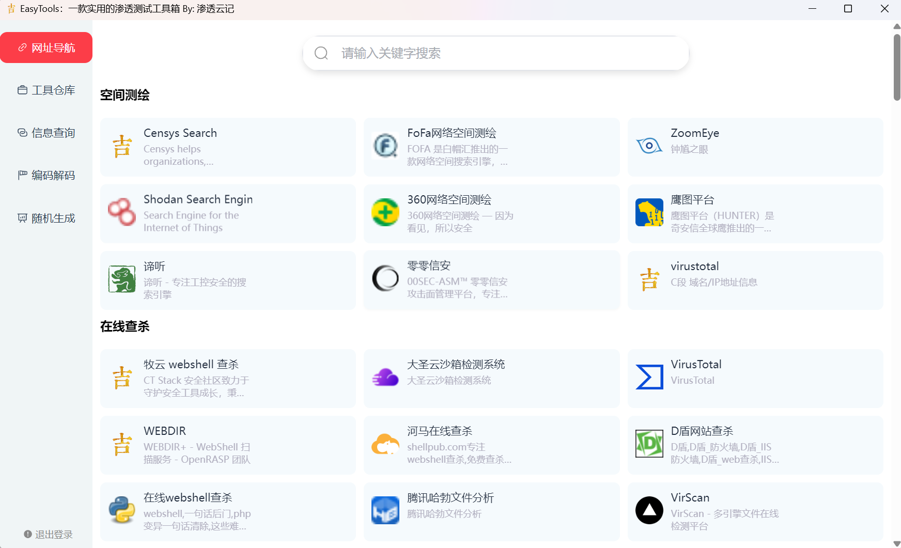
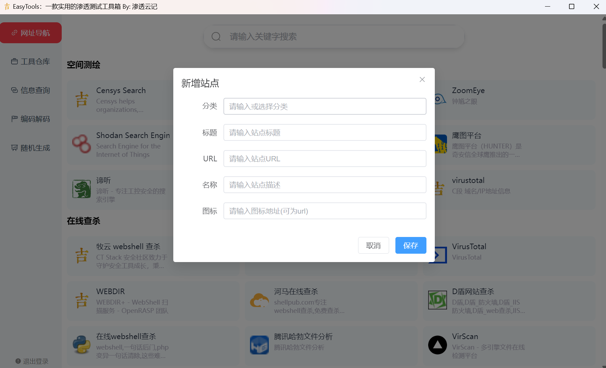
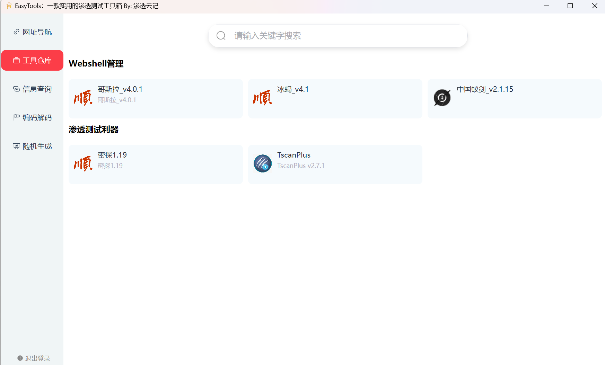
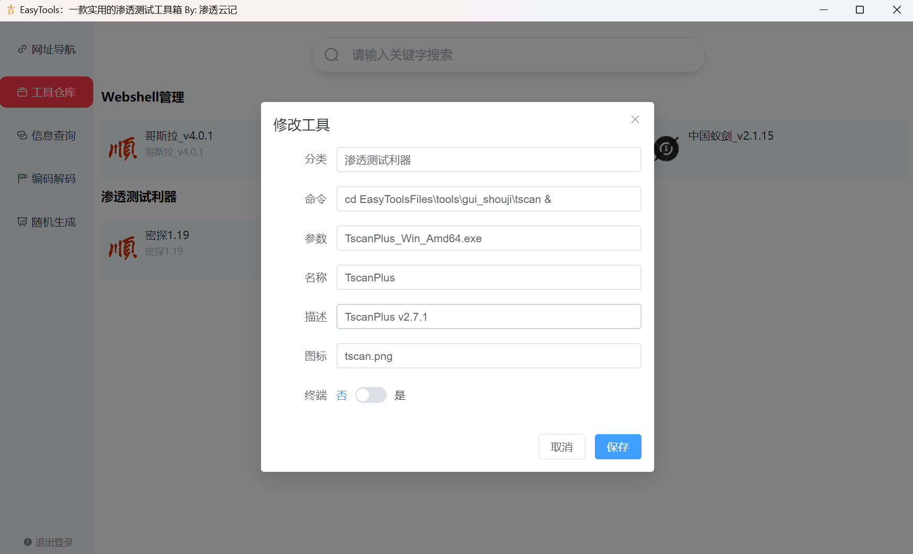
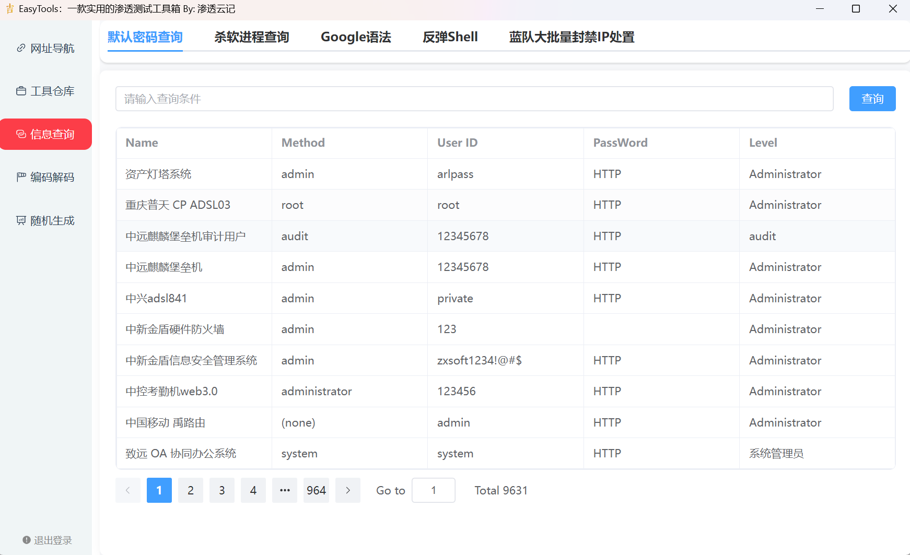
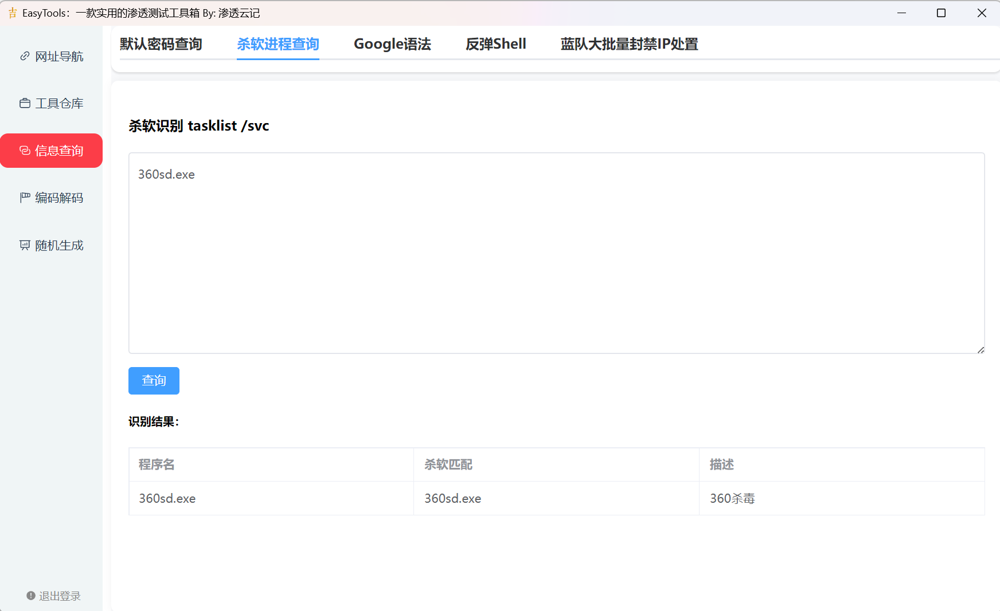
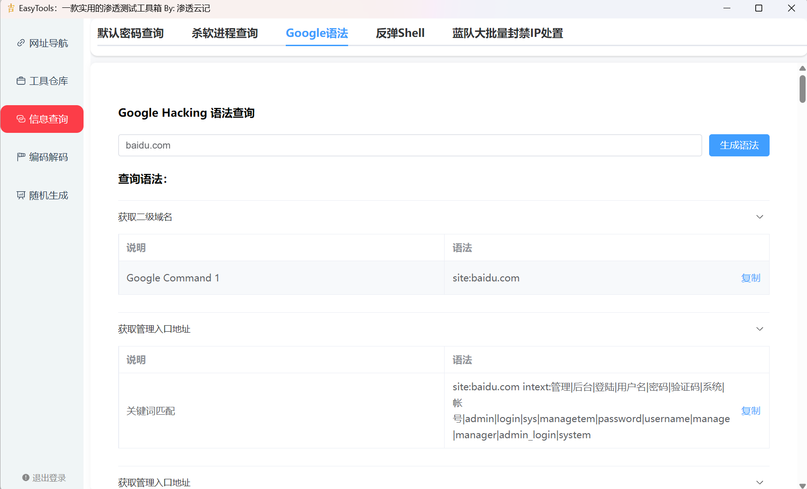
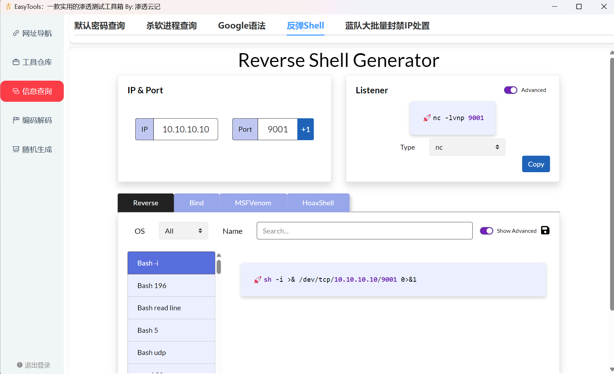
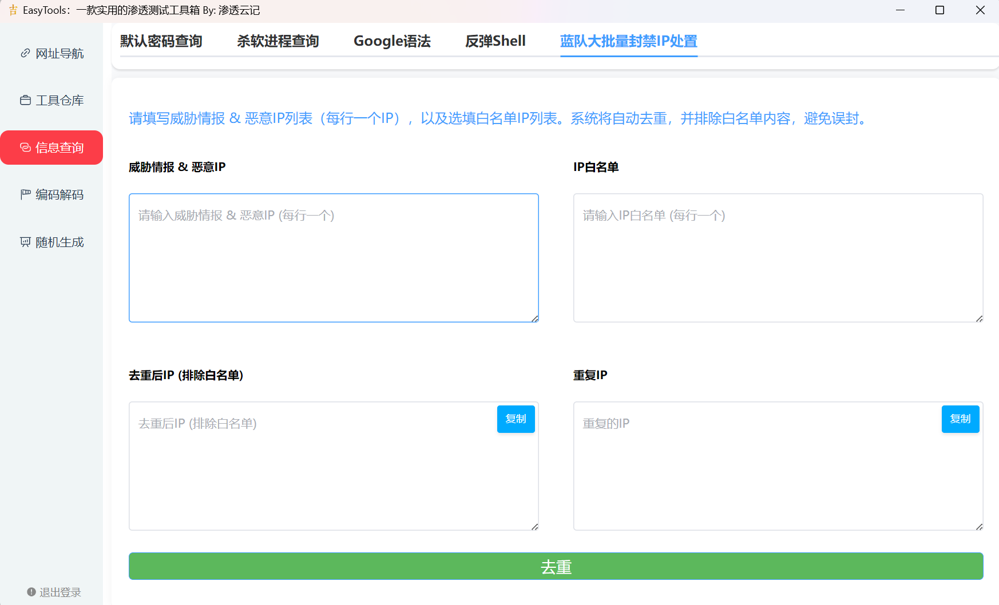
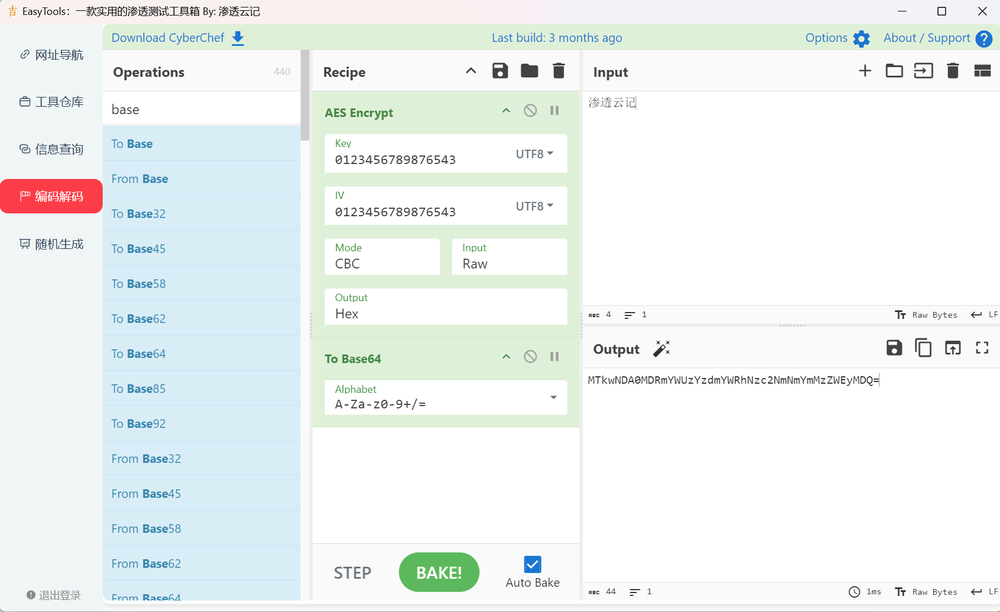

## 开发说明

在日常学习过程中，面对各种各样的测试任务，需要使用到多种工具助力，可是工具一多管理起来就不是很方便。

本着不重复造轮子的原则，本工具目前糅合了**网址导航、工具导航、信息查询、编码解码**等功能

针对能直接使用的功能，通过嵌入直接调用，在此感谢各位师傅的辛苦开源。

## 工具介绍

工具使用主打一个简洁，双击即可。

### 网址导航

通过右键支持新增、修改、删除。

当然查询也是可以的

### 工具仓库

依旧是右键新增、修改、删除。

因工具打包过大问题，暂不提供收集整理版本

优点：

+ 支撑自定义工具路径、不管你是C、D、E盘还是啥、都可以快速定位，无需将文件进行移动
+ 区分GUI程序与终端程序，优化打开体验，避免全屏cmd
+ 如果程序有图标的话，烦请放在`EasyToolsFiles\icon`路径下，程序会自动导入

### 信息查询

信息查询包括：默认密码查询、杀软进程查询、Google语法、反弹shell、蓝队大批量封禁IP处置

### 编码解码

编码解码直接使用的CyberChef，避免重复造轮子

​	

## 参考

本工具参考一下开源项目，感谢师傅的热心开源，谢谢。

后续将逐步更新功能，有好的建议也欢迎师傅提出，感激。

~~~html
https://github.com/xbuntu/godesk
https://github.com/0dayCTF/reverse-shell-generator
https://github.com/gchq/CyberChef
~~~