## 开发说明

在日常学习过程中，面对各种各样的测试任务，需要使用到多种工具助力，可是工具一多管理起来就不是很方便。

本着不重复造轮子的原则，本工具目前糅合了**网址导航、工具导航、信息查询、信息处理、编码解码**、**随机生成**、**免杀生成**等功能

针对能直接使用的功能，通过嵌入直接调用，在此感谢各位师傅的辛苦开源。

## 工具更新

**2025-2-25 v1.4**

+ 修复上一版本遗留的生成exe存在黑窗口的Bug
+ 新增一键去除upx特征的功能（测试，只是规避明显特征，避免直接upx -d脱壳）
+ 新增一键添加数字签名的小功能
+ 修改免杀模板，目前可过wdf、火绒、360（360过的比较艰难，需要多做尝试）
+ 修改已知bug
+ ……

**2025-2-16 v1.3**

+ 集成ShellCode在线免杀处理平台
+ 新增文件体积修改功能
+ 新增免杀：5种运行模式、2种加密方式、2种编译方式
+ 修改已知bug
+ ……

**2025-1-28 v1.2**

+ 新增信息处理模块
+ 新增Fscan数据处理模块
+ 迁移蓝队批量封禁IP模块至信息处理
+ 修改存在的bug

## 更新展示

## 工具介绍

工具使用主打一个简洁，双击即可。

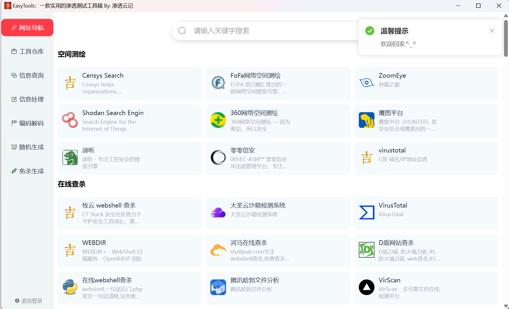

### 网址导航

通过右键支持新增、修改、删除。

当然查询也是可以的

如果程序有图标的话，烦请放在`EasyToolsFiles\icon`路径下，程序会自动导入，当然直接使用图片url也是可以的

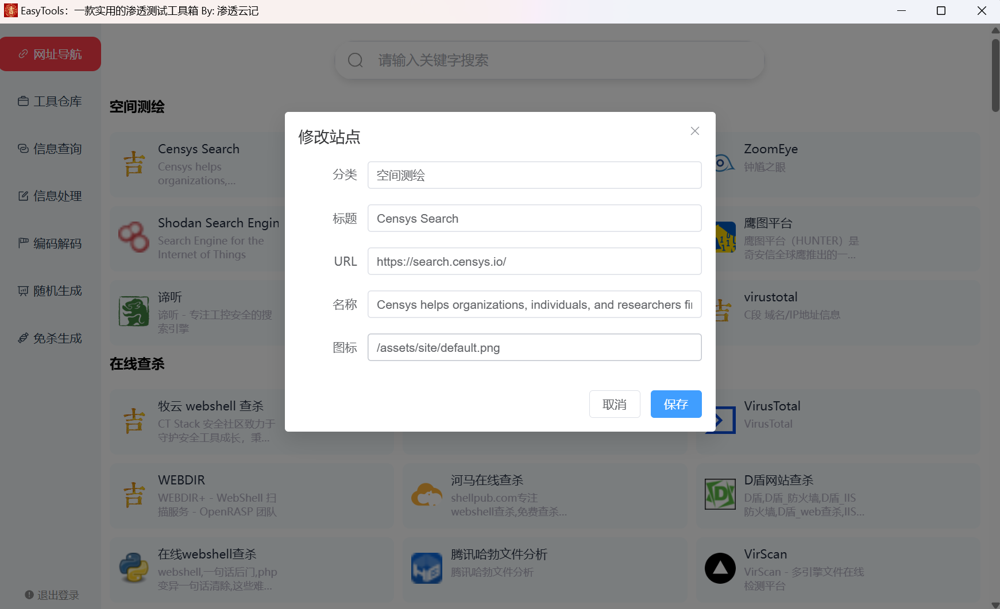

### 工具仓库

依旧是右键新增、修改、删除。

因工具打包过大问题，暂不提供收集整理版本

优点：

+ 支撑自定义工具路径、不管你是C、D、E盘还是啥、都可以快速定位，无需将文件进行移动
+ 区分GUI程序与终端程序，优化打开体验，避免全屏cmd
+ 如果程序有图标的话，烦请放在`EasyToolsFiles\icon`路径下，程序会自动导入，当然直接使用图片url也是可以的

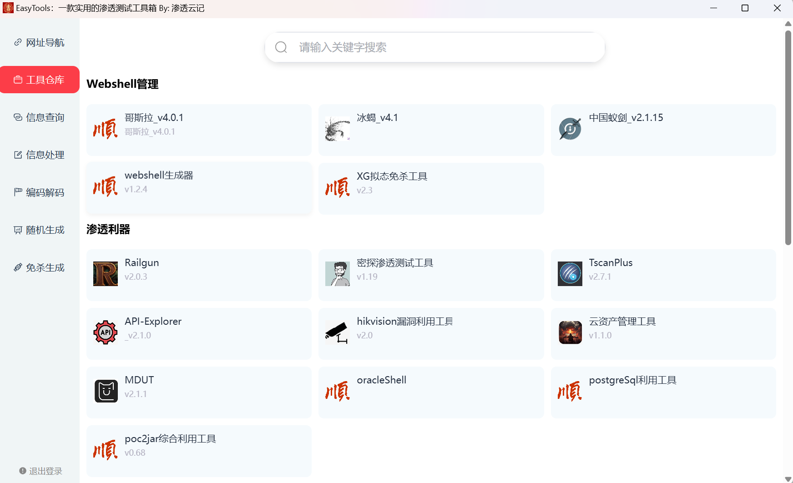

### 信息查询

信息查询包括：默认密码查询、杀软进程查询、Google语法、反弹shell

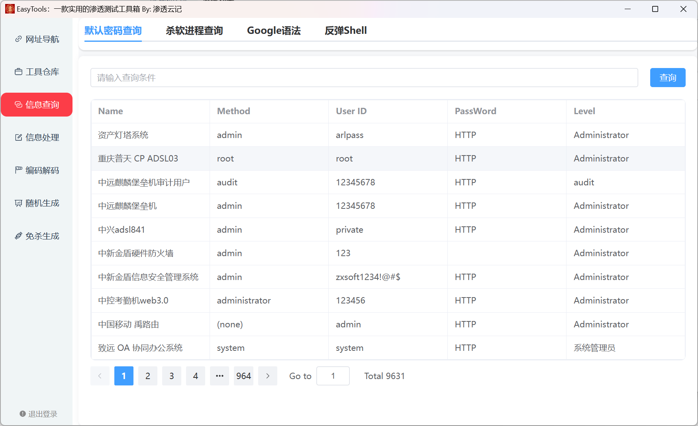

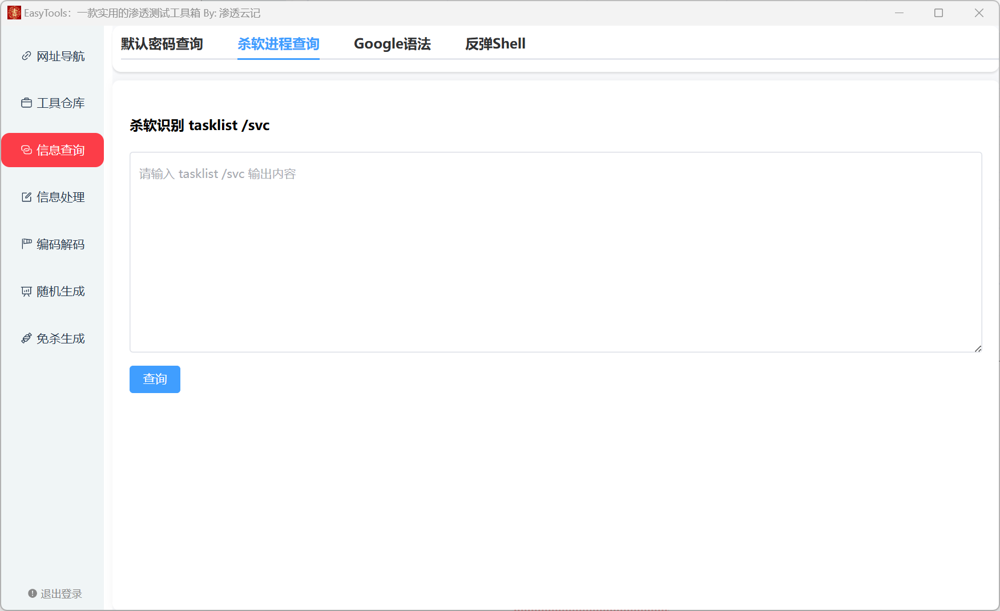

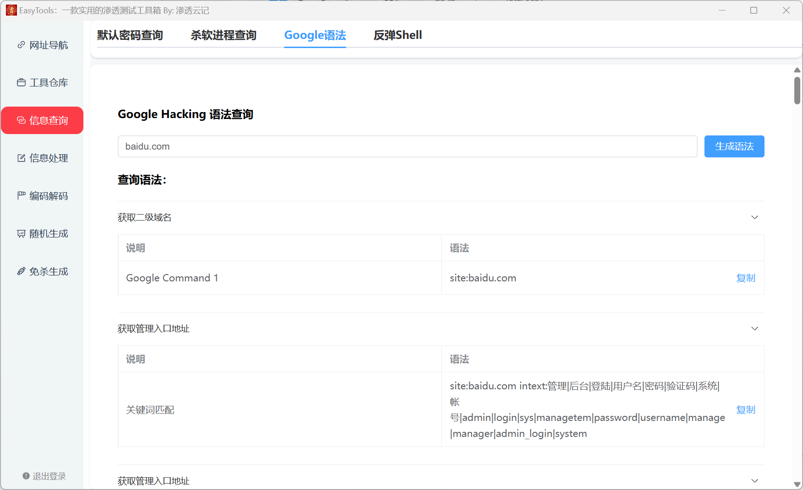

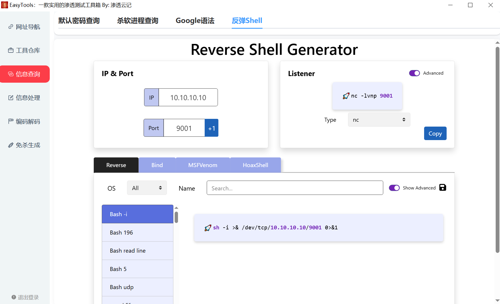

### 信息处理

信息处理包括：Fscan结果解析、蓝队大批量封禁IP处置

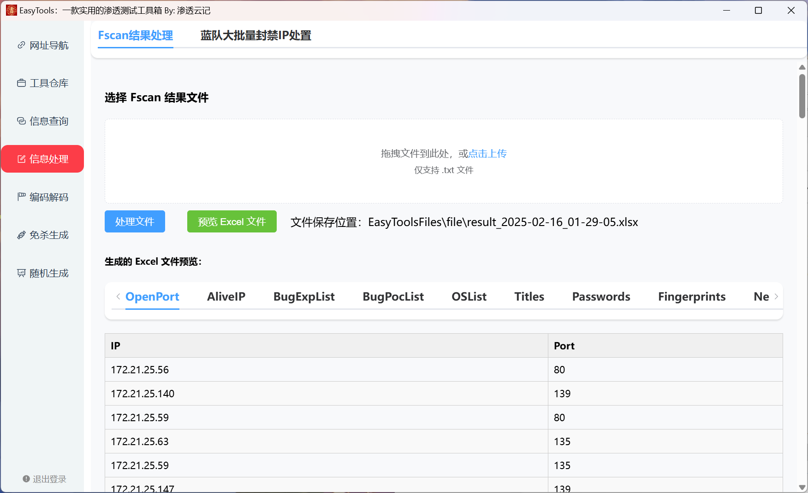

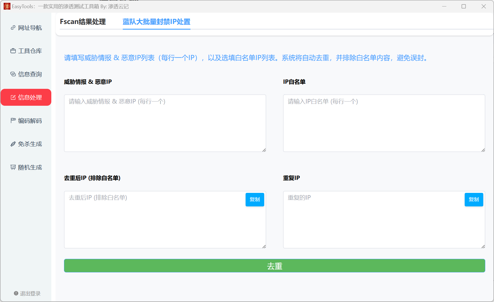

### 编码解码

编码解码直接使用的CyberChef，避免重复造轮子

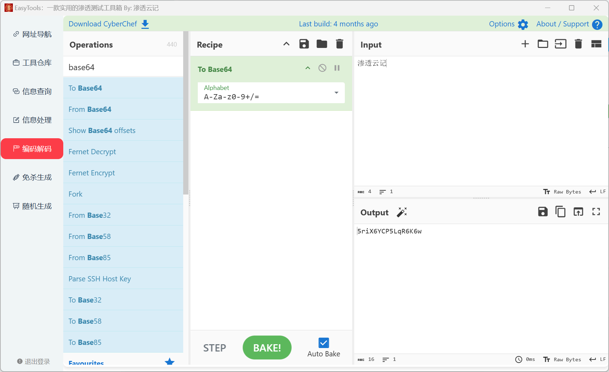

### 免杀生成

安装教程请见文档：

~~~
https://www.yuque.com/yuqueyonghuoxdahr/aae1ol/tdqgk1gwxns8g6ts?singleDoc# 《EasyTools免杀模块安装教程》
~~~

tips：生成文件存在黑窗口，需要手动处理一下

推荐编译方式使用garble，有点慢，请耐心等待

选择需要处理的bin文件，拖拽进行处理

选择运行模式、加密方式、需要规避的杀软类型、编译方式

目前支持5种运行模式、2种加密方式、2种编译方式

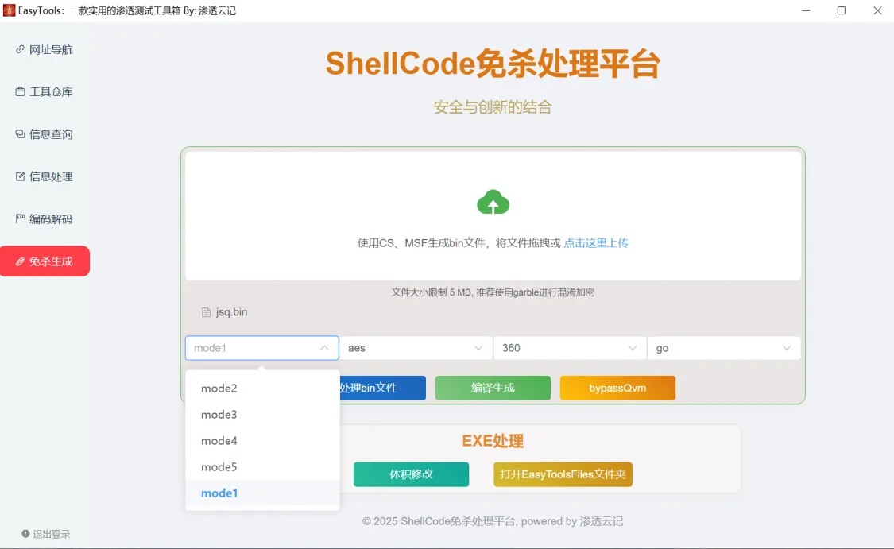

选择完成之后，点击处理bin文件、然后编译生成

针对360Qvm报毒，可以点击bypassQvm一键对生成的文件进行处理

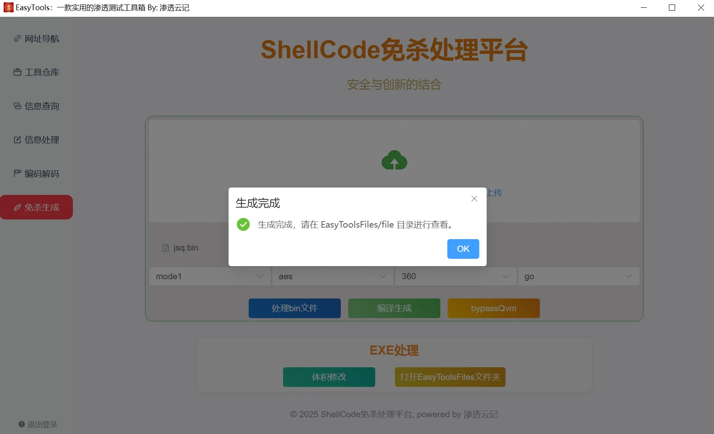

处理完的文件在EasyToolsFiles/file目录下，可以点击下方按钮一键打开

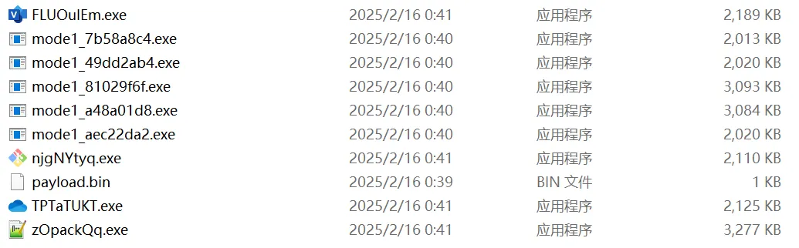

### 免杀监测

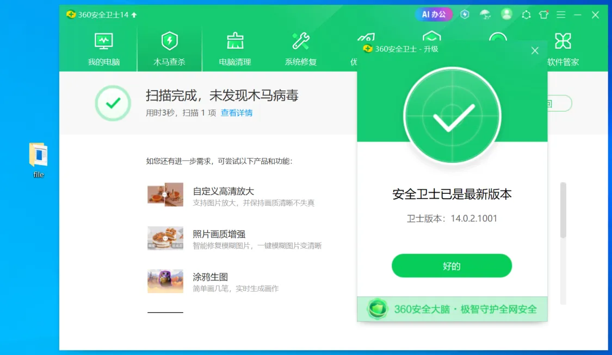

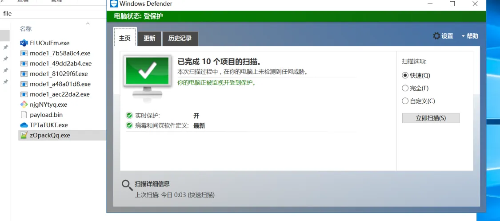

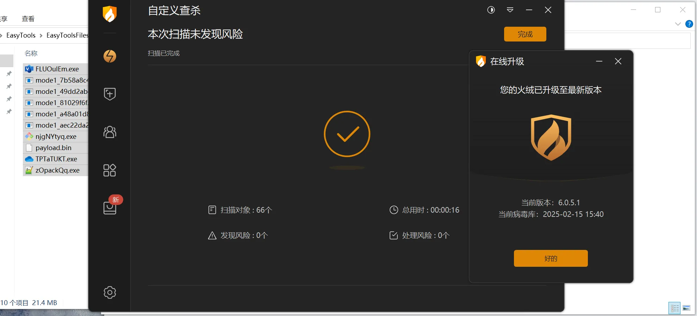

## 参考

本工具参考一下开源项目，感谢师傅的热心开源，谢谢。

后续将逐步更新功能，有好的建议也欢迎师傅提出，感激。

~~~html
https://github.com/xbuntu/godesk
https://github.com/0dayCTF/reverse-shell-generator
https://github.com/gchq/CyberChef
https://github.com/ZororoZ/fscanOutput
~~~
