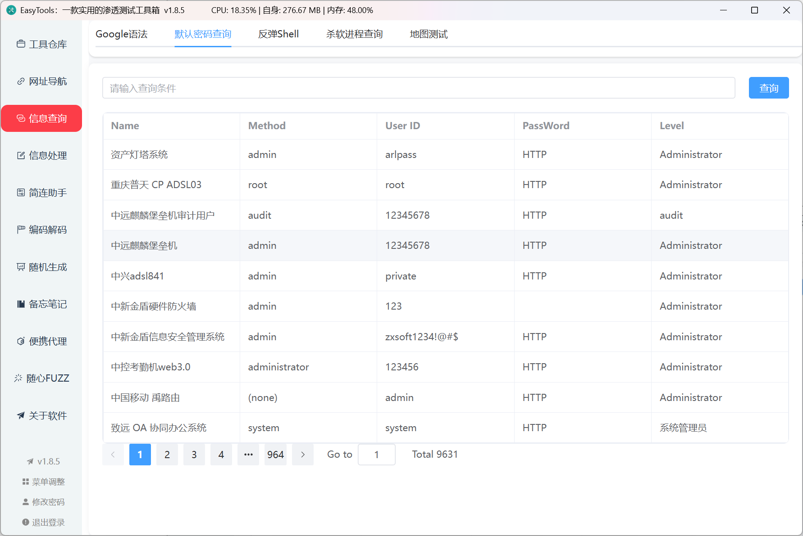

## 开发说明

在日常学习过程中，面对各种各样的测试任务，需要使用到多种工具助力，可是工具一多管理起来就不是很方便。

本着不重复造轮子的原则，本工具目前糅合了**工具导航**、**网址导航、简练助手、Redis连接、SSH连接、FTP连接、信息查询、信息处理、编码解码**、**随机生成**、**免杀生成**、**OSS资源桶信息提取**、**小程序反编译**、**JWT秘钥爆破、地图接口测试**、**代理池功能**、便携发包等功能

针对能直接使用的功能，通过嵌入直接调用，在此感谢各位师傅的辛苦开源。

## 更新说明

###  v1.9.8

1. 新增目录遍历提取功能(git泄露、svn泄露、index泄露、Ds_store泄露); 
2. 优化左侧菜单分类，移动随机生成至辅助功能; 
3. 优化google hackle功能、密码查询功能。

## 工具介绍

默认密码：**EasyTools/EasyTools**，如需修改直接点击状态栏左下角"修改密码"即可。（如果师傅不需要密码，可以自行打包删除即可）

tips：点一下输入框，但是不要输入就会提示密码，然后复制即可

**注：如果以前有使用EasyTools工具箱，需要注意一下内容：**

**1. 删除antivirus_list表，重新打开以更新最新版杀软列表**

工具使用主打一个简洁，双击即可。

### 工具仓库

通过右键支持新增、修改、删除、**打开文件夹位置**。

优点：

+ 支撑自定义工具路径、不管你是C、D、E盘还是啥、都可以快速定位，无需将文件进行移动
+ 区分GUI程序与终端程序，优化打开体验，避免全屏cmd
+ 如果程序有图标的话，烦请放在`EasyToolsFiles\icon`路径下，程序会自动导入，当然直接使用图片url也是可以的
+ tips: 例如java程序，如果需要使用多个版本，可以直接通过绝对路径进行启动哦、`C:\Java\jdk1.8\bin\java.exe -jar xxxx.jar`

**v1.8.6 更新：**修改命令执行逻辑，现在只需要配置好文件路径之后，直接执行相关命令即可，程序内置cd命令，无需手动输入了

**兼容以前的写好的cd命令，不过建议修改一下，避免bug**

~~~
假如运行哥斯拉：

路径：C:\EasyTools\tools\Godzilla
命令：java -jar godzilla.jar
参数：这里如果还需要执行其他命令，写上程序会自动拼接，最终运行命令如下
cd /D EasyToolsFiles\tools\gui_webshell\Godzilla && loader.vbs [可选参数]
~~~

### 网址导航

依旧是右键新增、修改、删除。

如果程序有图标的话，烦请放在`EasyToolsFiles\icon`路径下，程序会自动导入，当然直接使用图片url也是可以的

**v1.8.9 更新：**新增自动获取站点信息以及下载ico图标，如果失败请手动配置即可

### 信息查询

信息查询包括：Google语法、默认密码查询、反弹shell、杀软进程查询、地图测试

### 信息处理

信息处理包括：Fscan结果解析（适配fscan1.8.4版本）、蓝队大批量封禁IP处置、OSS资源桶遍、小程序反编译、jwt秘钥破解

### 简连助手

新增简单的SSH连接功能、FTP连接功能、Redis连接功能，便于在某些特殊情况下应急使用。

#### SSH

#### FTP

#### Redis

### Ctf工具

编码解码直接使用的CyberChef，避免重复造轮子

新增Pcap流量包分析

### 代理池

### Cli执行工具

支持任何你需要执行的cli脚本，支持定时任务执行

### 随机生成

随机生成这里提供两种，分别是密码生成，手机号生成（这个主要是在方便测试过程中限制归属地使用）

### 备忘笔记

备忘笔记主要就是简单实现了一下md的预览与编辑功能，方便咱们在测试的过程中快捷查询需要的命令

### 便携发包

类似于postman，支持环境变量、get、post、del、put等各种常用功能

### 免杀生成（已下架）

### 系统管理

目前系统管理设置了菜单自定义调整、快捷键隐藏与显示功能（win专属）

## 程序编译

#### （1）手动编译

+ 下载程序

~~~
git clone https://github.com/doki-byte/EasyTools.git
~~~

+ 安装前端依赖

~~~
cd frontend
npm install
~~~

+ 运行程序

~~~
wails dev
~~~

+ 编译程序

~~~
wails build --trimpath -ldflags="-w -s"
~~~

#### （2）利用github action自动编译

+ fork EasyTools项目
+ 创建release，注意tag设置规则v*，即设置v1.0.0版本号，等待自动编译完成即可

#### （3）MAC用户运行提示

1. 优先查看版本架构是否正确
2. `sudo spctl --master-disable`,此行代码可以让 Mac 允许安装第三方来源的应用

## 交流反馈

因本人非专业开发，故而程序在使用过程中会出现诸多不可控的bug

期待各位师傅们对出现的bug，以及需要增加的功能，提出宝贵的建议及意见，感激！！！

## 参考

本工具参考一下开源项目，感谢师傅的热心开源，谢谢。

后续将逐步更新功能，有好的建议也欢迎师傅提出，感激。

~~~html
https://github.com/xbuntu/godesk
https://github.com/0dayCTF/reverse-shell-generator
https://github.com/gchq/CyberChef
https://github.com/ZororoZ/fscanOutput
https://github.com/o8oo8o/WebSSH
https://github.com/broken5/unveilr
https://github.com/fasnow/fine
~~~